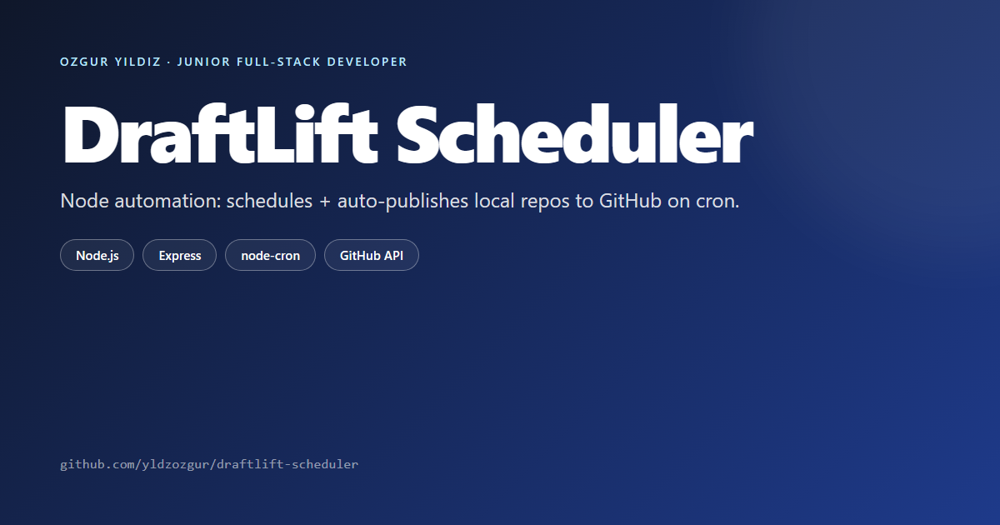

<p align="center"></p>

# DraftLift Scheduler

A self-hosted tool for publishing finished local project folders to GitHub. Upload a project through the web UI, choose a publish date, and DraftLift creates the repository and pushes the code on schedule, recording every run in an append-only audit log.

It is built for the case where you have completed projects sitting on disk and want to get them onto GitHub in an organized way, with a record of what was published and when.

## How it works

1. Upload a project folder through the web UI. It is stored as a draft.
2. Set a publish date for the draft.
3. When the date is due, DraftLift initializes a git repository, creates the GitHub repository if it does not exist, commits the files, and pushes.
4. The result of every run is appended to an audit log.

Failures are surfaced in the UI and the project stays in the drafts area so it can be retried.

## Stack

| Layer | Tools |
|---|---|
| Runtime | Node.js 18+ |
| Web server | Express |
| Scheduler | node-cron |
| File operations | fs-extra, child_process for git |
| Frontend | Vanilla JS (ES Modules), SCSS |
| Process manager (optional) | PM2 |

No build pipeline beyond Sass. Light enough to run on a small VPS or a Raspberry Pi.

## Self-hosting

Prerequisites: Node.js 18+, the git CLI on PATH, and a GitHub Personal Access Token with `repo` scope.

```bash
git clone https://github.com/yldzozgur/draftlift-scheduler.git
cd draftlift-scheduler
npm install
```

Create a `.env` file with your GitHub token:

```env
GITHUB_TOKEN=your_personal_access_token
```

Then start the server:

```bash
npm start          # production
npm run dev        # nodemon + Sass watch
```

Open the URL printed in the console, upload a project folder, and set a publish date. Git settings (owner, branch, default visibility) are stored in `data/admin-config.json` and can be edited through the UI.

### Optional: run with PM2

```bash
npm install -g pm2
pm2 start ecosystem.config.js
pm2 save
```

## Audit log

Each run appends one JSON object per line to the audit log: timestamp, project, operation, result, and any error. It is easy to tail or grep.

## Roadmap

- Publish webhooks (Slack / Discord / email)
- Multi-account GitHub support
- Optional CI run before publish

## License

ISC. Built by [Ozgur Yildiz](https://github.com/yldzozgur).
